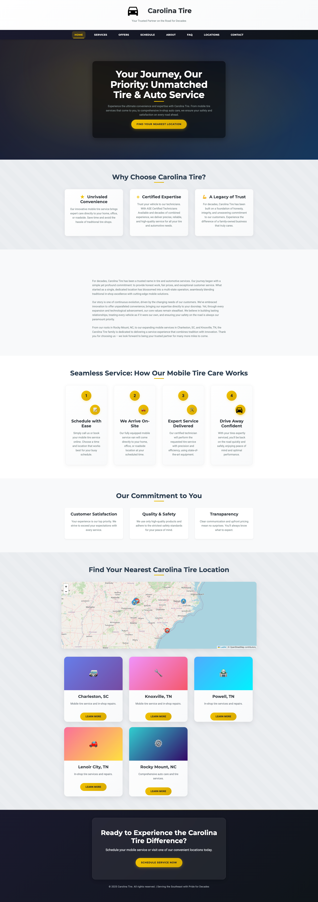
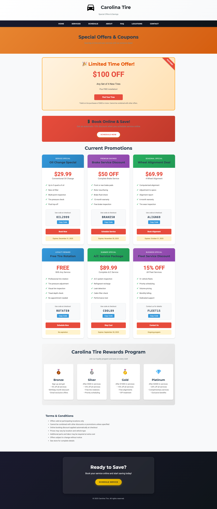
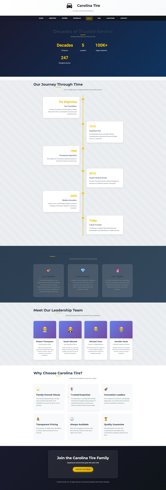
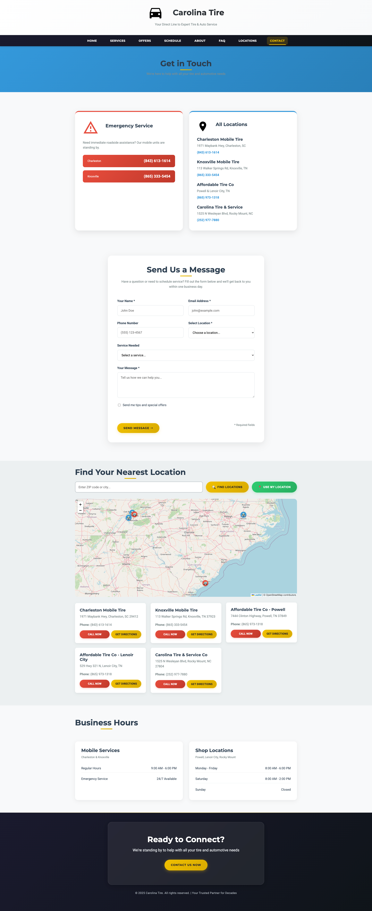
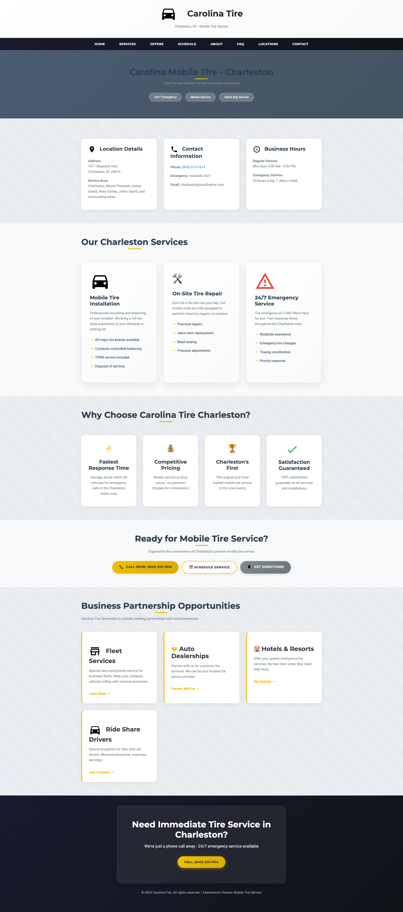
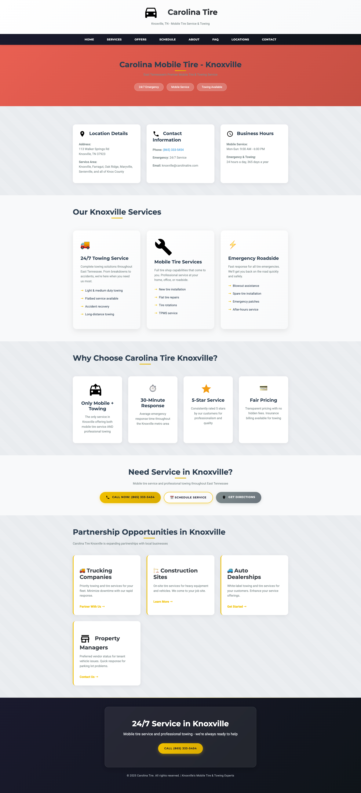
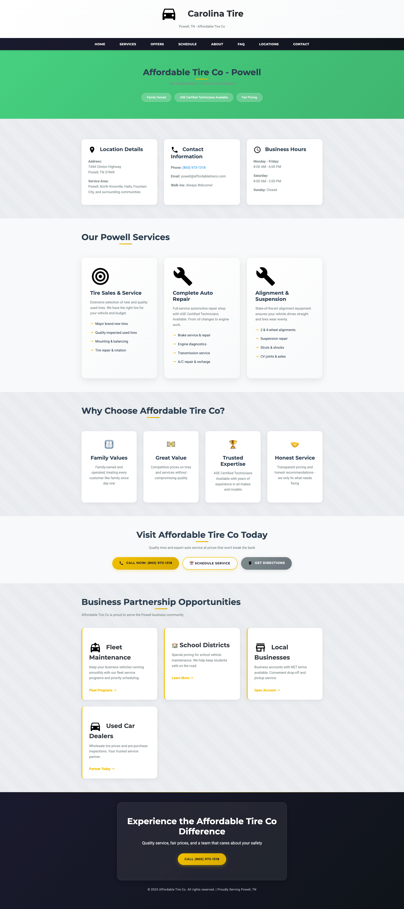
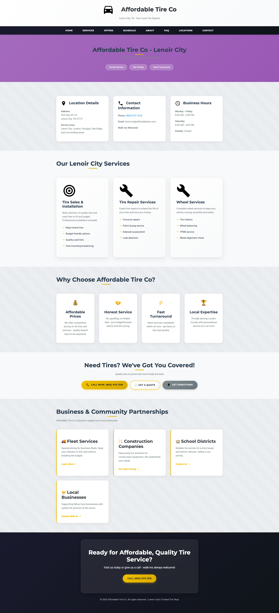
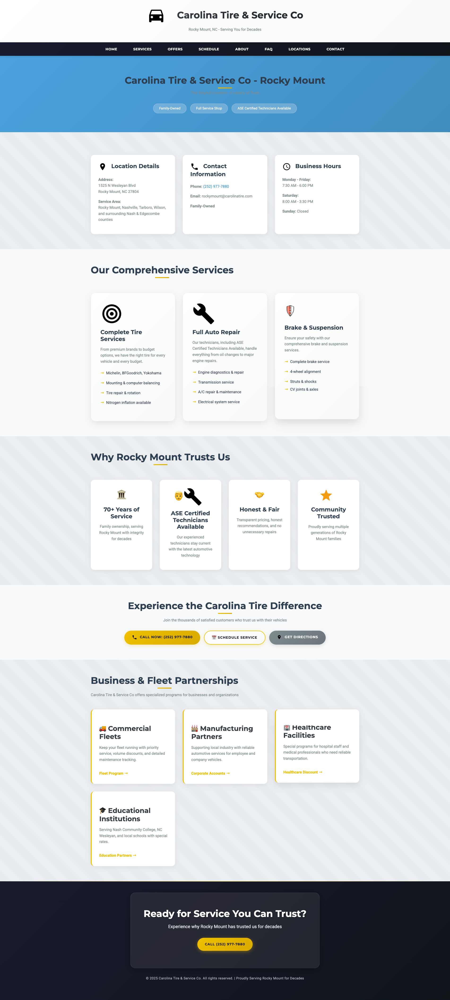

# Carolina Mobile Tire - Professional Website

A modern, responsive website for Carolina Mobile Tire, showcasing mobile tire services across multiple locations in North Carolina and Tennessee. Built with clean HTML, CSS, and JavaScript for optimal performance and user experience.

## 🚀 Features

- **Responsive Design** - Optimized for all devices (desktop, tablet, mobile)
- **Modern UI/UX** - Clean, professional design with smooth animations
- **Location-Based Services** - Multiple service locations across NC & TN
- **Service Booking** - Integrated scheduling system for mobile tire services
- **Interactive Maps** - Location finder with embedded maps
- **Performance Optimized** - Fast loading times with optimized assets
- **SEO Ready** - Structured markup and meta tags for search engines
- **Docker Support** - Production-ready containerization

## 🌟 Live Preview



### Key Pages

<table>
  <tr>
    <td align="center" width="33%">
      <strong>Services Overview</strong><br>
      <a href="screenshots/Services.png">
        
      </a>
    </td>
    <td align="center" width="33%">
      <strong>Special Offers</strong><br>
      <a href="screenshots/Offers.png">
        
      </a>
    </td>
    <td align="center" width="33%">
      <strong>About Us</strong><br>
      <a href="screenshots/About.png">
        
      </a>
    </td>
  </tr>
  <tr>
    <td align="center" width="50%">
      <strong>FAQ Section</strong><br>
      <a href="screenshots/FAQ.png">
        
      </a>
    </td>
    <td align="center" width="50%">
      <strong>Contact Information</strong><br>
      <a href="screenshots/Contact.png">
        
      </a>
    </td>
    <td></td>
  </tr>
</table>

### Service Locations

<table>
  <tr>
    <td align="center" width="33%">
      <strong>Charleston, SC</strong><br>
      <a href="screenshots/Charleston-Location.png">
        
      </a>
    </td>
    <td align="center" width="33%">
      <strong>Knoxville, TN</strong><br>
      <a href="screenshots/Knoxville-Location.png">
        
      </a>
    </td>
    <td align="center" width="33%">
      <strong>Powell, TN</strong><br>
      <a href="screenshots/Powell-Tn-Location.png">
        
      </a>
    </td>
  </tr>
  <tr>
    <td align="center" width="50%">
      <strong>Lenoir City, TN</strong><br>
      <a href="screenshots/Lenoir-City-Tn-Location.png">
        
      </a>
    </td>
    <td align="center" width="50%">
      <strong>Rocky Mount, NC</strong><br>
      <a href="screenshots/Rocky-Mount-NC-Location.png">
        
      </a>
    </td>
    <td></td>
  </tr>
</table>

## 🛠 Tech Stack

- **Frontend**: HTML5, CSS3, JavaScript (ES6+)
- **Styling**: Custom CSS with responsive design
- **Maps**: Interactive location maps
- **Server**: Python HTTP server for development
- **Production**: Nginx in Docker container
- **Container**: Docker & Docker Compose

## 🚀 Quick Start

### Development Server

```bash
# Clone the repository
git clone https://github.com/MagicUnicornInc/Carolina-Mobile-Tire.git
cd Carolina-Mobile-Tire

# Start development server
python3 server.py
```

Visit `http://localhost:7100` to view the website.

### Docker Deployment (Recommended for Production)

#### 🚀 Automated Deployment Script (Recommended)

Use the interactive deployment script for easy setup with automatic port detection:

```bash
# Make script executable (first time only)
chmod +x deploy.sh

# Run interactive deployment
./deploy.sh

# Or quick deploy with auto-detected port
./deploy.sh --quick
```

**Features of deploy.sh:**
- 🔍 **Automatic port detection** - Finds next available port if default is in use
- 🎯 **Interactive setup** - Choose your own port and container name
- 📊 **Container management** - Start, stop, restart, view logs, check status
- 💾 **Backup functionality** - Create backups of your website files
- 🔄 **Update from GitHub** - Pull latest changes and redeploy
- 🏃 **Quick deploy mode** - One-command deployment with `--quick`

#### Manual Docker Deployment

```bash
# Build and run with Docker Compose
docker-compose up -d

# View logs
docker-compose logs -f

# Stop the container
docker-compose down
```

The website will be available at `http://localhost:7100` (or your selected port).

## 📁 Project Structure

```
carolina-tire-website/
├── src/                    # Website source files
│   ├── index.html         # Homepage
│   ├── about.html         # About page
│   ├── services.html      # Services overview
│   ├── offers.html        # Special offers
│   ├── faq.html          # FAQ page
│   ├── contact.html       # Contact information
│   ├── schedule.html      # Service scheduling
│   ├── tire-finder.html   # Tire finder tool
│   ├── privacy.html       # Privacy policy
│   ├── terms.html         # Terms of service
│   ├── locations/         # Location-specific pages
│   │   ├── charleston.html
│   │   ├── knoxville.html
│   │   ├── powell.html
│   │   ├── lenoir-city.html
│   │   └── rocky-mount.html
│   ├── images/            # Image assets
│   ├── styles.css         # Main stylesheet
│   ├── script.js          # Main JavaScript
│   ├── map.js            # Map functionality
│   ├── icons.js          # Icon definitions
│   ├── contact.js        # Contact form logic
│   ├── schedule.js       # Scheduling logic
│   ├── sitemap.xml       # SEO sitemap
│   └── robots.txt        # SEO robots file
├── screenshots/           # Website screenshots
├── deploy.sh             # Automated deployment script
├── Dockerfile            # Docker configuration
├── docker-compose.yml    # Docker Compose setup
├── nginx.conf            # Nginx configuration
├── server.py             # Development server
├── .dockerignore         # Docker ignore rules
└── README.md             # Project documentation
```

## 🔧 Configuration

### Server Configuration

The website can be configured to run on different hosts and ports:

**Development (server.py):**
```python
PORT = 7100
HOST = "0.0.0.0"  # Accessible from network
```

**Production (nginx.conf):**
```nginx
server {
    listen 7100;
    server_name _;
    root /usr/share/nginx/html;
}
```

### Docker Configuration

The Docker setup includes:
- **Multi-stage build** for optimized image size
- **Nginx Alpine** base for production performance
- **Security headers** for enhanced security
- **Gzip compression** for faster loading
- **Health checks** for container monitoring
- **Volume mounts** for easy development

## 🌐 Deployment

### Local Development
```bash
python3 server.py
```

### Docker Production
```bash
docker-compose up -d
```

### Manual Docker Build
```bash
docker build -t carolina-tire-website .
docker run -p 7100:7100 carolina-tire-website
```

## 📱 Browser Support

- ✅ Chrome 90+
- ✅ Firefox 88+
- ✅ Safari 14+
- ✅ Edge 90+
- ✅ Mobile browsers (iOS Safari, Chrome Mobile)

## 🔒 Security Features

- Content Security Policy headers
- XSS protection
- MIME type sniffing prevention
- Clickjacking protection
- Referrer policy configuration
- Secure cookie handling

## 🚀 Performance Features

- **Optimized Assets** - Compressed images and minified code
- **Caching Strategy** - Static asset caching with long expiration
- **Gzip Compression** - Enabled for all text-based resources
- **Lazy Loading** - Images load as needed
- **Minimal Dependencies** - Vanilla JavaScript, no heavy frameworks

## 📊 SEO Features

- Structured data markup
- Meta tags optimization
- Sitemap.xml included
- Robots.txt configured
- Open Graph tags
- Twitter Card support
- Mobile-friendly design
- Fast loading speeds

## 🤝 Contributing

1. Fork the repository
2. Create your feature branch (`git checkout -b feature/AmazingFeature`)
3. Commit your changes (`git commit -m 'Add some AmazingFeature'`)
4. Push to the branch (`git push origin feature/AmazingFeature`)
5. Open a Pull Request

## 📄 License

This project is licensed under the MIT License - see the [LICENSE](LICENSE) file for details.

## 🆘 Support

For support, email support@carolinatire.com or create an issue in this repository.

## 🏢 About Carolina Mobile Tire

Carolina Mobile Tire provides professional mobile tire services across North Carolina and Tennessee. We bring the tire shop to you with:

- Mobile tire installation and repair
- 24/7 emergency roadside assistance  
- Fleet services for businesses
- Tire sales from major brands
- Wheel alignment and balancing
- Professional and certified technicians

**Service Areas:**
- Charleston, SC
- Knoxville, TN  
- Powell, TN
- Lenoir City, TN
- Rocky Mount, NC

---

**Built with ❤️ for Carolina Mobile Tire**
